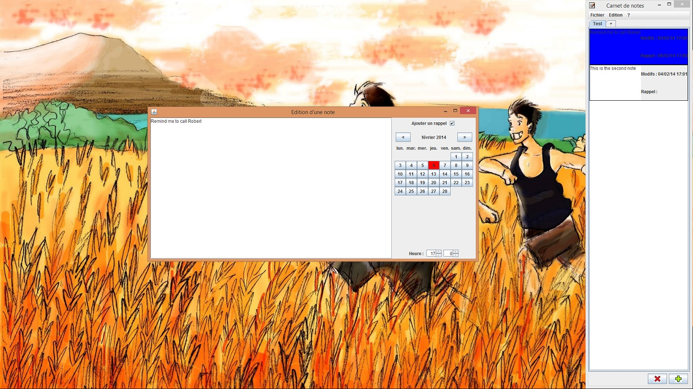

.. contents::

What is dev-notes?
=====================

dev-notes is a little prorgram in Java which can help you to organize your mind easily.

Screenshot
------------------------

Main features
=====================

- Add time schedule to record you to do something,
- **Automatic save** (no need to click button save+button quit),
- Possibility to arrange order of notes,